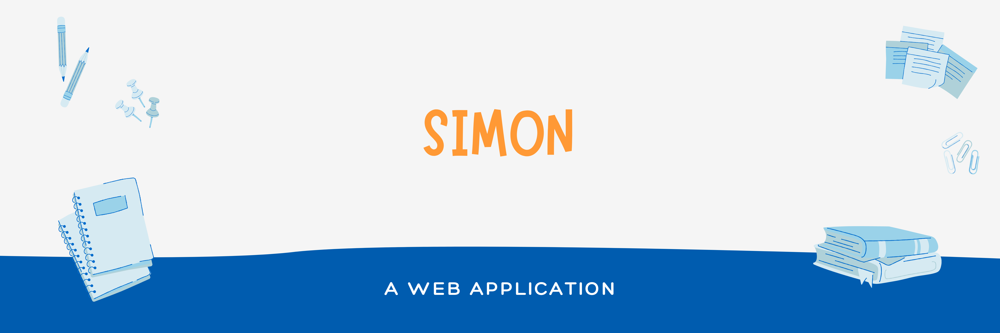

<h2> 🧩 SIMON </h2>
Basically, The <a href="https://ajaiqmar.github.io/SIMON/">SIMON</a> 🧩 Application is a Web application which is built during my Web Development Bootcamp with Angela Yu as mentor. It was really a Informative Journey.

<h2> 📱TECHNOLOGY STACK </h2>

